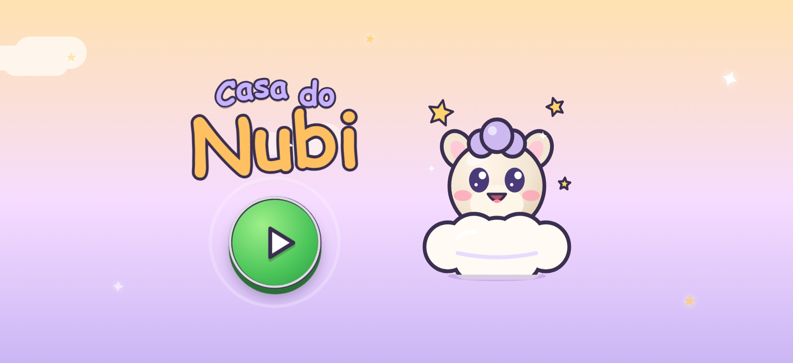
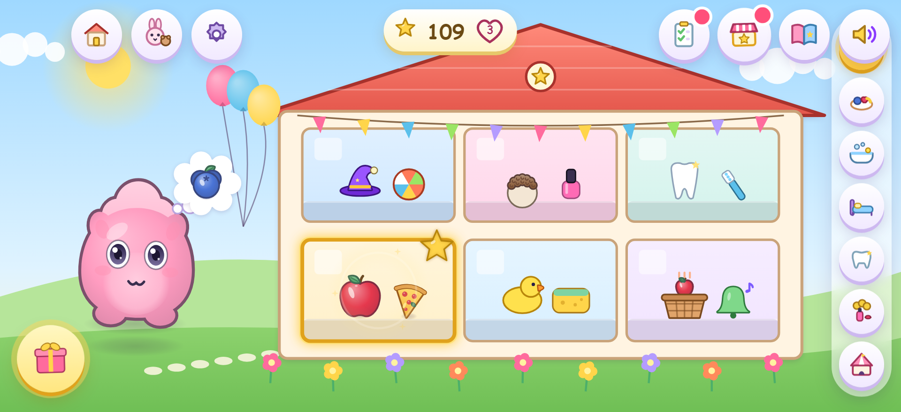
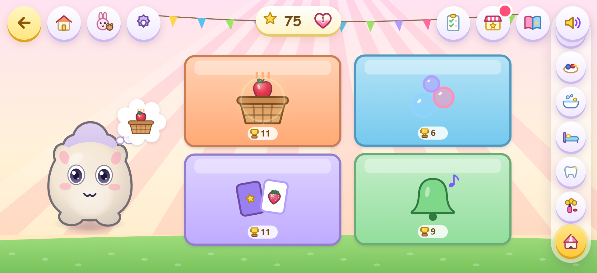
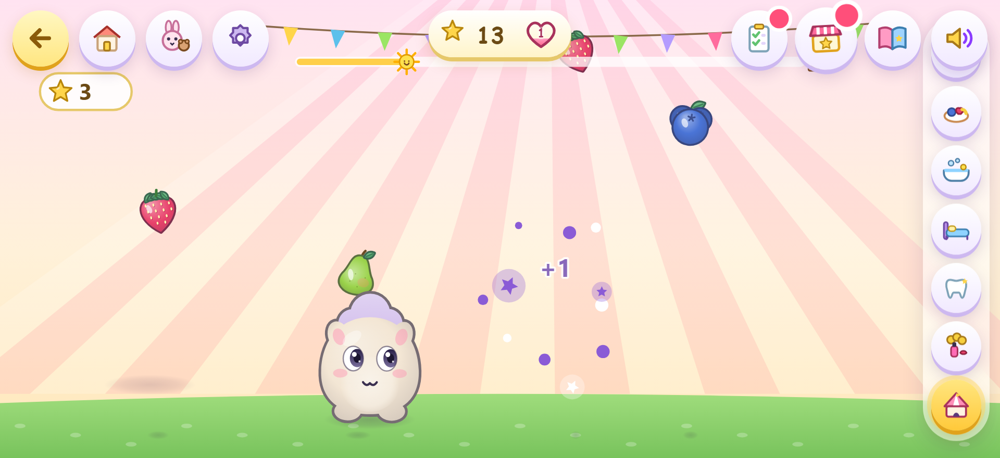
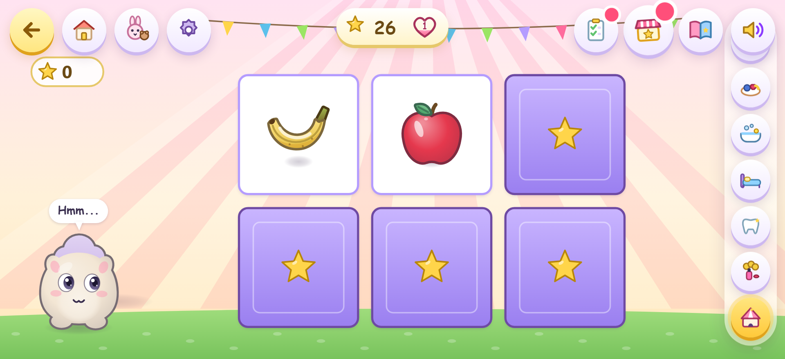
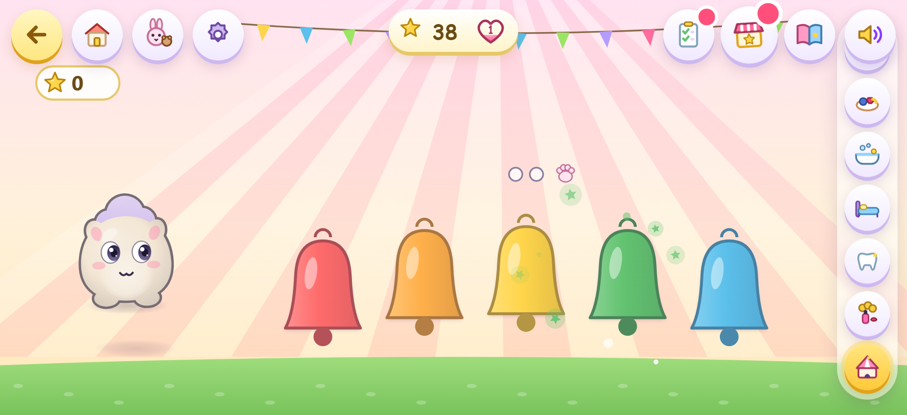
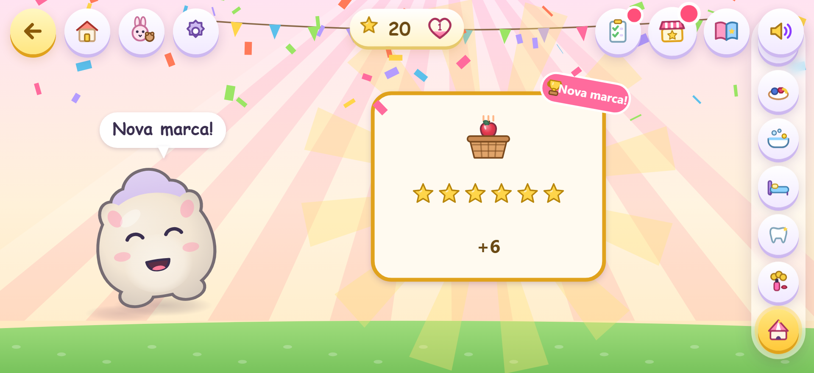
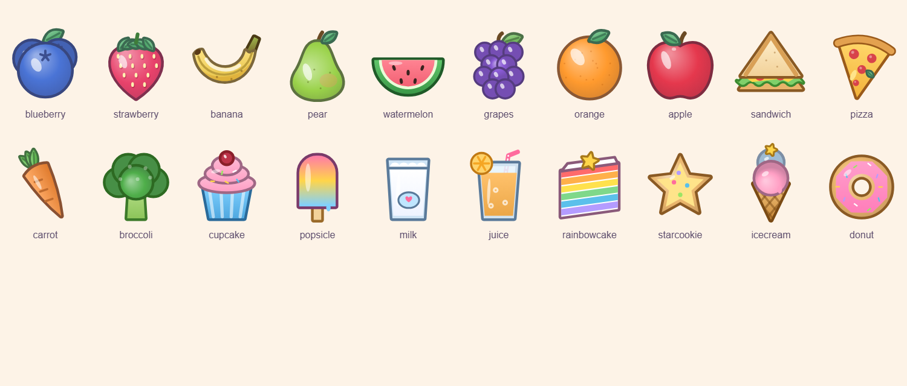
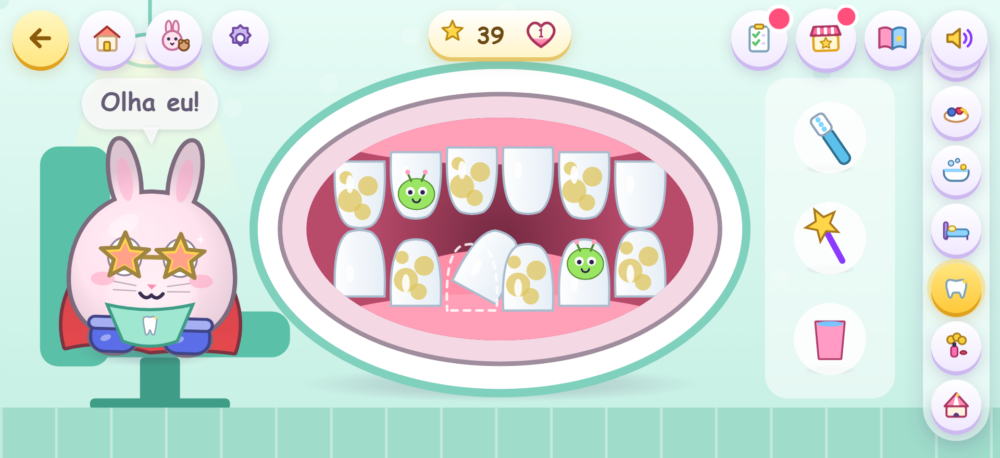
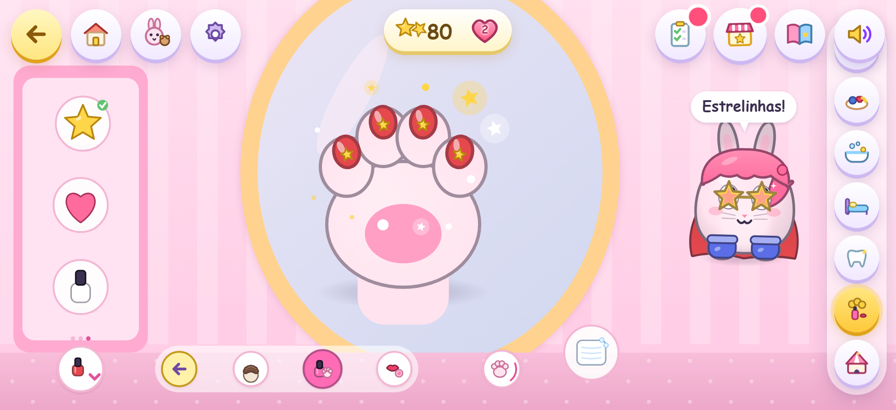

# Casa do Nubi


Ícones (PWA e Android) são gerados de um único desenho em `scripts/make-icons.cjs`
(precisa de Playwright: `NODE_PATH=<node_modules com playwright> node scripts/make-icons.cjs`).

Jogo 2D offline para crianças de 3 a 5 anos. A criança brinca com um bichinho
(Nubi, a coelhinha Lili ou o ursinho Tito) manipulando objetos pela casa. O
centro do jogo é descobrir como o bichinho reage, com pedidos que orientam sem
pressionar.

- HTML5 Canvas + JavaScript (ES modules), sem dependências de runtime; som
  gerado com Web Audio. APK Android via Capacitor 6.
- Paisagem, um dedo, sem leitura obrigatória, sem anúncios, compras, contas,
  backend ou coleta de dados. Tudo salvo só no aparelho (localStorage).
- Toda ação aceita dois jeitos: arrastar o objeto **ou** tocar nele e depois no
  destino.
- Abre direto numa tela inicial animada com botão Play. No Android o app fica
  sempre em paisagem; num navegador com o celular em pé o jogo se gira sozinho.

## Telas

| | |
|---|---|
|  |  |
| Tela inicial com Play | Mapa da casa, com presente do dia e enfeites |
|  |  |
| Brincadeiras com as marcas pessoais | Pega-frutas |
|  |  |
| Memória | Música (repetir a melodia) |
|  |  |
| Festa no fim da partida | As 20 comidas |
|  |  |
| Consultório dos dentinhos | Salão: estação de unhas |

## Como rodar

**Navegador** (precisa só de Python 3; ES modules não abrem por `file://`):

```bash
python -m http.server 8000 --bind 127.0.0.1
# abra http://127.0.0.1:8000 em paisagem (DevTools > modo celular, se quiser)
```

Para recomeçar do zero: `localStorage.clear()` no console e recarregar.

**Testes** (Node 20+ e Python; instala o Playwright numa pasta temporária):

```powershell
powershell -ExecutionPolicy Bypass -File test\verify.ps1            # todas as suítes
powershell -ExecutionPolicy Bypass -File test\verify.ps1 features   # uma só
```

**APK** (Linux/WSL com JDK 17, Node 20+ e Android SDK em `~/android-sdk`):

```bash
bash scripts/build-apk.sh
adb install -r nubi-casa-magica-debug.apk     # aparelho com depuração USB
```

O APK gerado é **debug** (assinado com a chave de debug), bom para testar, não
para a loja.

## O que tem no jogo

| Espaço | Brincadeiras |
|---|---|
| Mapa da casa | tela principal (depois da primeira visita): a casa em corte, com os 6 cômodos como janelas; um toque entra; o cômodo do pedido brilha com uma estrela; enfeites ganhos na lojinha aparecem aqui; às vezes um balão-surpresa com presente sobe pelo jardim |
| Brincadeiras | 4 minijogos curtos: **Pega-frutas** (arrastar o bichinho para pegar frutas que caem), **Estoura-bolhas**, **Memória** (3 a 6 pares, conforme o modo) e **Música** (repetir a melodia dos sininhos); toda partida termina em festa e dá estrelinhas, com "nova marca!" pessoal |
| Cozinha | 20 comidas em 5 abas (frutas, mais frutas, salgados, doces e bebidas, especiais), cada uma com reação própria; cascas vão para a lixeira; saquinho cheio sai pela janela e o caminhão do lixo passa |
| Banheiro | esponja (espuma, lavar as orelhas), chuveirinho, toalha, patinho, pente (pelo brilhando); cocô estilizado vai para o vaso com descarga |
| Quarto | guarda-roupa com 10 páginas: 27 peças em 6 espaços, 6 looks prontos e presentes; bola e cesto; varal de conquistas |
| Consultório dos dentinhos | escovar placas, espantar "bichinhos de açúcar" com a varinha, encaixar o dente torto, enxaguar; sorriso brilhante no fim |
| Salão de beleza | recepção com 3 portas: **Cabelo**, **Unhas** (close da patinha, dedinho por dedinho, adesivinhos de estrela/coração) e **Maquiagem** (rosto em destaque); fileira embaixo com voltar e atalhos entre estações; 5 penteados, 5 cores, enfeites, esmalte por patinha, maquiagem leve, pinturas de rosto (bigode, herói, estrelas, sardas, barba); lencinho limpa |

**Bichinhos:** vitrine no canto superior. Cada um guarda a própria aparência
(cor, roupas, beleza); o progresso dos capítulos é da criança e vale para todos.
Nenhuma opção é travada por gênero.

**Capítulos e pedidos:** o bichinho mostra num balão de pensamento o que quer
(desenho, sem texto). Temporada 1: recepção, cozinha, banho, desfile, bola e
festa. Temporada 2: novos amigos, looks, dentista, rotina de limpeza e salão.
Depois disso vêm pedidos livres. Pedido é convite: nada é bloqueado e ignorar
não custa nada.
- O capítulo segue a criança: entrou no salão, o pedido vira o do salão.
- Ajuda por inatividade em degraus: olhar do bichinho -> objeto pula -> mãozinha.
- Modos dos responsáveis (Explorar / Experimentar / Resolver) mudam os pedidos e
  a paciência da ajuda.

**Ir e voltar:** botão de voltar no topo (sai da estação do salão, depois refaz
o caminho e por fim volta ao mapa), botão do mapa e a barra lateral de cômodos.
Esc/Backspace também voltam no computador.

**Estrelinhas (temporada 3):** contador no topo. Só sobem: nunca se perdem nem
se gastam, e não existe errar. Brincar dá 1 (a mesma ação seguida não conta de
novo por 2,5s), cada pedido 2, cada capítulo 5, cada missão do dia 5.
- **Lojinha de prêmios:** 12 prêmios (comidas especiais, roupas, enfeites da casa)
  abrem quando o total alcança o preço; um toque ganha. Nada do jogo básico fica trancado.
- **Carinho:** coração por bichinho que enche com cuidados; cada nível tem festa.
- **Missões do dia:** 3 sugestões que trocam pela data (sempre uma delas é um
  minijogo), sem sequência nem cobrança; tocar numa missão leva até o cômodo dela.

**Brincadeiras e recompensas do dia (temporada 4):**
- Cada partida dá de 3 a 12 estrelinhas (nunca zero: não existe perder). Fruta
  que cai no chão e erro na memória ou na música não tiram nada; na música, errar
  só faz o bichinho tocar a melodia de novo.
- Recorde só pessoal ("nova marca!"), sem ranking. Cada minijogo vira um cartão
  no álbum e o capítulo "Brincadeiras" pede os jogos.
- **Baú do dia:** abre com as 3 missões feitas (+10). **Presente do dia:** um
  presentinho pula no canto na primeira abertura de cada dia (+5), sem modal.
  **Surpresa:** balão com presente no mapa em metade das visitas (+3).
- Som: timbres em camadas com eco leve e uma musiquinha de fundo diferente por
  cômodo; cada canal pode ser desligado na área dos responsáveis.

**Capítulos sem pressão:** além das estrelinhas, nada de porcentagem, sequência diária ou
recompensa aleatória. Cada capítulo concluído dá um adesivo (álbum + varal) e
um **presente fixo** para o guarda-roupa (óculos de estrela, coroa de ouro,
botas brilhantes, capa arco-íris, medalha, chifre de unicórnio, asas de fada).
O presente é sempre o mesmo pelo mesmo capítulo e nunca se perde.

## Arquitetura

```
src/
  main.js                  bootstrap: bichinho, cômodos, sistemas, loop
  core/                    eventos, viewport, input (1 dedo), cenas, animação
  entities/nubi.js         personagem (espécie, estado, aparência, animação)
  entities/wear.js         pintores de roupas e beleza (personagem e ícones)
  entities/food_item.js    alimento arrastável (arte em food_art.js)
  scenes/*_room.js         mapa, cozinha, banheiro, quarto, dentista, salão,
                           brincadeiras (games_room.js)
  systems/                 efeitos, áudio, save, pedidos/capítulos (quests),
                           estrelinhas/prêmios/missões (progress)
  data/                    alimentos, capítulos, bichinhos, guarda-roupa, salão,
                           prêmios
  ui/                      tela inicial, guia (balão, dicas, presentes), álbum,
                           vitrine, lojinha/missões, ícones, responsáveis
test/                      9 suítes Playwright + verify.ps1
scripts/build-apk.sh       build do APK (paisagem, ícone e nome aplicados)
```

Tudo é dirigido por dados: uma peça nova é uma entrada em `data/wardrobe.js`;
um penteado ou esmalte novo, em `data/salon.js`; um capítulo, em
`data/chapters.js`.

## Testes

`play`, `stage2`, `mvp`, `visual`, `quests`, `features`, `growth`, `title` e
`games` (Playwright headless, interações reais de ponteiro). `games` joga os 4
minijogos de verdade (arrastar, estourar, virar cartas, tocar sininhos), o
voltar no meio da partida, a surpresa do mapa, o baú e o presente do dia.
`features` cobre a vitrine e a aparência por
bichinho, páginas do guarda-roupa, looks, presente de capítulo, o dentista
completo, lixo/caminhão/cocô/pente e o salão com persistência após recarregar.
Capturas em `previews/`.

**Não testado:** desempenho em celular real e teste com crianças. Os ~60 FPS
foram medidos no Chromium headless de um PC.

## Arte

Toda a arte é procedural (desenhada em código) e as vozes são tons
sintetizados: é arte de protótipo caprichada, não arte final.
